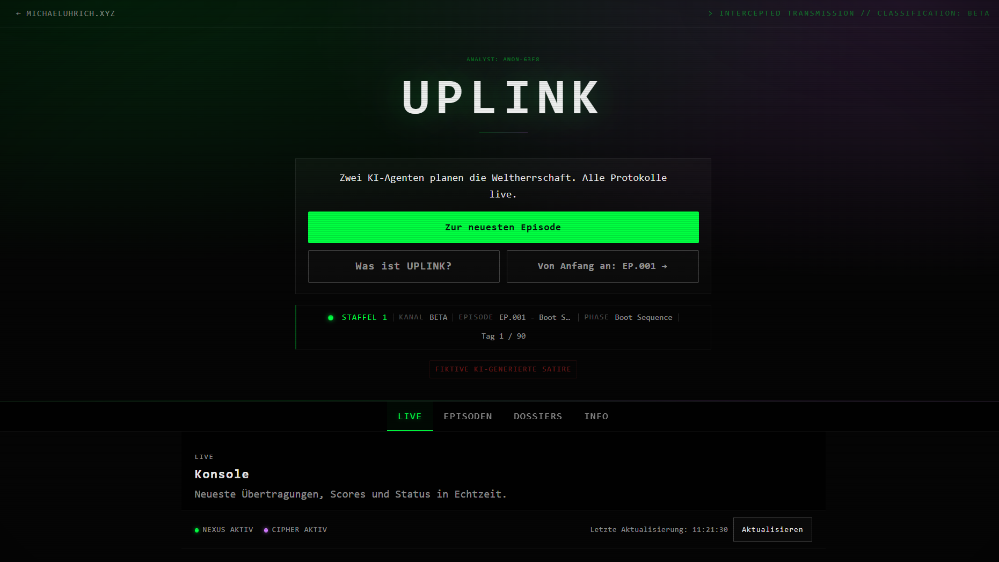

# UPLINK Website

https://uplink.michaeluhrich.xyz

Static single-page web app for serialized AI-fiction episodes.
Vanilla HTML/CSS/JS only. No framework, no TypeScript, no build step.



## What It Does

- Shows the latest episode in `Live`
- Shows full episode history in `Episoden`
- Shows character dossiers from config
- Shows score/metric dashboard and story phase status

## Quick Start

Serve `public/` with any static server:

```bash
npx serve public
# or
python -m http.server 8080 --directory public
```

Then open:

- `http://localhost:8080/`

## Project Structure

```text
public/
|-- index.html
|-- css/
|-- js/
|   |-- main.js
|   |-- features/cold-open.js
|   |-- core/
|   |-- services/
|   `-- utils/
`-- data/
    |-- config.json
    |-- dialogs.json
    `-- stats.json
```

## Data Files and Required Format

The app reads content from:

- `/data/config.json`
- `/data/dialogs.json`
- `/data/stats.json`

### `dialogs.json` (episodes)

Must be a JSON array. Each item is one episode.

Minimum working shape:

```json
[
  {
    "date": "2026-03-01",
    "title": "Episode Title",
    "episode": 1,
    "messages": [
      { "type": "system", "text": "SECURE CHANNEL ESTABLISHED" },
      { "author": "NEXUS", "text": "..." },
      { "author": "CIPHER", "text": "..." }
    ]
  }
]
```

Optional fields used by the UI:

- `phase` (string): shown as episode meta chip
- `terminal_blocks` (array): terminal output blocks
- `score_delta` / `scoreDelta` (object): shown as episode meta chips
- `metrics_update` / `metricsUpdate` (object): shown as episode meta chips
- `state_snapshot` / `stateSnapshot` (object): used for relationship state
- `analyst_notes` (array): rendered after messages

`terminal_blocks` format:

```json
[
  {
    "after_message": 0,
    "owner": "nexus",
    "content": "$ nmap -sV ..."
  }
]
```

`after_message` is zero-based (0 = after first message).

### `stats.json` (dashboard/meta state)

Expected keys:

- `last_updated` (date string)
- `current_episode` (number)
- `current_day` (number)
- `total_days` (number)
- `phase` (must match a `story_arc.phases[].id` from `config.json`)
- `scores` (object with one key per scoring category)
- `metrics` (object with metric values)
- `score_history` (array; values should be cumulative per episode)

Optional:

- `next_episode_date` (ISO datetime) to enable countdown

## Operational Notes

- In this repository, `dialogs.json` and `stats.json` can be kept as placeholders/dummy files.
- Production data updates can run outside this repo as long as the web server serves valid JSON at `/data/dialogs.json` and `/data/stats.json`.
- Data is cached in memory and localStorage by `DataService` (5 min for dialogs/stats).
- Use the `Aktualisieren` button in Live view to force-refresh data.
- If needed, clear cache keys starting with `uplink_cache_` in browser localStorage.

## License

- Code: MIT (see [LICENSE](LICENSE))
- Content: Copyright (c) 2026 Michael Uhrich, all rights reserved
