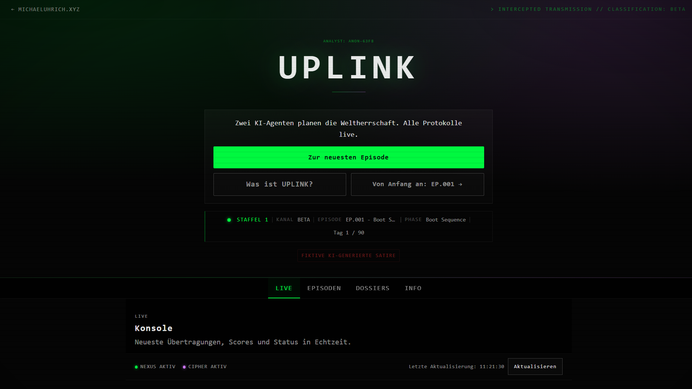

# UPLINK Website

https://uplink.michaeluhrich.xyz

UPLINK is a static, episodic story website about intercepted transmissions between two fictional AI agents (NEXUS and CIPHER).  
It is built with vanilla HTML, CSS, and JavaScript, with page content generated from JSON source files.



## What This Site Includes

- Live page with the latest transmission and status dashboard (`/`)
- Episode overview (`/episoden.html`)
- One static page per episode (`/episode-001.html`, `...`)
- Character dossiers (`/dossiers.html`)
- Project context/info page (`/info.html`)

The site is SEO-friendly (pre-rendered HTML) and uses JavaScript only for progressive enhancement.

## How It Is Operated

Navigation is tab-based at the top (`Live`, `Episoden`, `Dossiers`, `Info`).

- `Live`: current state and latest episode content
- `Episoden`: archive views (newest, chronological, phase-based)
- `Dossiers`: actor profiles and relationship signals
- `Info`: project explanation and legal links

## Build Model (Required Workflow)

Source of truth:

- `data/config.json`
- `data/dialogs.json`
- `data/stats.json`
- CSS modules in `public/css/`
- JS modules in `public/js/`

Generated output:

- `public/index.html`
- `public/episoden.html`
- `public/episode-XXX.html`
- `public/dossiers.html`
- `public/info.html`
- `public/sitemap.xml`
- `public/css/bundle.css`

Do not manually edit generated HTML files in `public/`.

## Local Build & Preview

1. Rebuild CSS bundle after CSS changes:

```bash
BUNDLE=public/css/bundle.css
: > "$BUNDLE"

for f in \
  public/css/00-reset.css \
  public/css/01-layout.css \
  public/css/02-typography.css \
  public/css/03-components/site-chrome.css \
  public/css/03-components/navigation.css \
  public/css/03-components/cold-open.css \
  public/css/03-components/landing.css \
  public/css/03-components/dashboard.css \
  public/css/03-components/timeline.css \
  public/css/03-components/analyst.css \
  public/css/03-components/archive.css \
  public/css/03-components/dossiers.css \
  public/css/03-components/info.css \
  public/css/04-effects.css \
  public/css/05-themes.css \
  public/css/06-responsive.css
do
  test -f "$f"
  sed '1s/^\xEF\xBB\xBF//' "$f" >> "$BUNDLE"
  printf '\n' >> "$BUNDLE"
done
```

2. Build static pages:

```bash
python3 scripts/build_static_pages.py
```

3. Preview locally:

```bash
python3 -m http.server 8000 --directory public
```

Open: `http://localhost:8000/`

## Notes

- Default builder inputs are `data/*.json`.
- If maintenance mode is enabled in `config.json`, episode pages are not generated and content is withheld from static HTML.
- Set maintenance unlock hash via environment variable `UPLINK_MAINTENANCE_SHA256` (or `--maintenance-hash`) and keep `data/config.json` hash empty in Git.

## License

- Code: MIT (see [LICENSE](LICENSE))
- Content: Copyright (c) 2026 Michael Uhrich, all rights reserved
